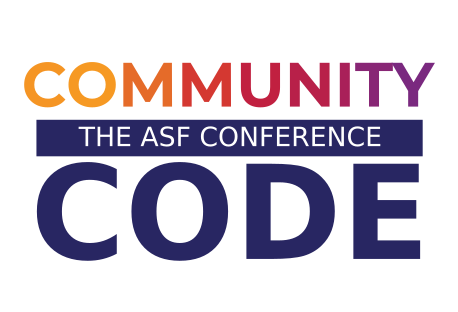

Title: Brand Guidelines
page_heading: ASF Brand Guidelines
license: https://www.apache.org/licenses/LICENSE-2.0

The ASF’s brand guidelines and trademark policy ensure consistent use of our brand logo and assets to help people easily identify the Foundation and its work. All uses of ASF trademarks, service marks, and graphic logos must abide by our [Identity Style Guide](/foundation/press/kit/ApacheFoundation_StyleGuide.pdf) and [Trademark Policy](/foundation/marks/).

**ASF Graphics**
*   [Foundation Logos](#logo) - the formal ASF logo
*   [Powered By Apache Logos](#poweredby) - for Apache projects
*   [ASF Sticker Template](#sticker) — pictorial marks of the ASF logo with taglines
*   [Community Over Code Logos](#eventlogo) - the official Community Over Code event logo

## Foundation Logos {#logo}

### Foundation Logo 

*   [ASF Logo - SVG](asf_logo_wide.svg)

*   [ASF Logo - PDF](asf_logo_wide.pdf)

*   [ASF Logo - EMF](asf_logo_wide.emf)

### Logo Mark 

*   [Logo Mark SVG](feather.svg)

*   [Logo Mark PDF](feather.pdf)

*   [Logo Mark EMF](feather.emf)

## Powered By Apache Logos  {#poweredby}

“Powered By” logos can be used by the ASF community-at-large on websites, documentation, and other marketing materials.

Guidelines for the appropriate use of the “Powered By Apache” logos include:

*   The “Powered By Apache” circular banded logo may be used standalone with The ASF logo mark (denoting general use of an ASF project) or in combination with an official/authorized ASF Project logo.
*   The official/authorized Project logo may not be altered in any way other than removing/separating the name(s) where applicable as approved by the associated Project Management Committee.
*   The appropriate trademark symbol(s), such as ® or ™, associated with the project's logo must be included in the logo.
*   The logo's circular band format, font, and color must not be altered in any way.
*   The logo and/or its contents must not be rotated, animated, distorted, or otherwise altered, nor should it be used as a graphic element, background, or pattern.
*   The logo and/or its contents must not be translated or localized, nor should it have versioning numbers or other unauthorized words added to it.
*   The preferred background color for the logo is white, however, the logo may appear on colored, black, or image/photographic backgrounds providing the logo's legibility is not compromised.
*   The logo may be sized and produced in multiple file formats as required by the Project Management Committee, with a preferred minimum size of 80 pixels high in Web/online applications (where possible) to ensure legibility.
*   The logo may not, under any circumstances, be incorporated with a third party's company name, product name, or logo(s), or adopt marks and/or logos that are confusingly similar to or imply improper association with The Apache Software Foundation.
*   Third parties and programs are not allowed to use official Apache project logos and/or create alternate logos or identifying marks relating to any Apache project without written permission from the associated Project Management Committee and/or ASF Brand Management.
*   We have a [trademark use policy for the "Powered By" phrase][1]

### "Powered By" Logo  

[Powered By Apache Logo - PDF](poweredBy/Apache_PoweredBy.pdf)

[Powered By Apache Logo - SVG](poweredBy/Apache_PoweredBy.svg)

[Powered By Apache Logo - EMF](poweredBy/Apache_PoweredBy.emf)

### Project "Powered By" Logos 

September 11, 2025: The process for updating Project "Powered By" logos will be updated in the coming weeks. In the meantime, please use the new Powered By logos above.

## ASF Sticker Template  {#sticker}

Stickers containing pictorial marks of the ASF logo with various taglines and colors are available for broad community use. These images can be used in any application.

### 

|     *Purple*     |   *Red*   |     *Orange*     |    *Yellow*   |    *Blue*   |
|------------------|-----------|------------------|---------------|-------------|
| [AI](img/the-apache-way-badge/ASF_Badge_apacheway-purple.ai) [EPS](img/the-apache-way-badge/ASF_Badge_apacheway-purple.eps) [PDF](img/the-apache-way-badge/ASF_Badge_apacheway-purple.pdf) [PNG](img/the-apache-way-badge/ASF_Badge_apacheway-purple.png) [JPG](img/the-apache-way-badge/ASF_Badge_apacheway-purple.jpg) | [AI](img/the-apache-way-badge/ASF_Badge_apacheway-red.ai) [EPS](img/the-apache-way-badge/ASF_Badge_apacheway-red.eps) [PDF](img/the-apache-way-badge/ASF_Badge_apacheway-red.pdf) [PNG](img/the-apache-way-badge/ASF_Badge_apacheway-red.png) [JPG](img/the-apache-way-badge/ASF_Badge_apacheway-red.jpg) | [AI](img/the-apache-way-badge/ASF_Badge_apacheway-orange.ai) [EPS](img/the-apache-way-badge/ASF_Badge_apacheway-orange.eps) [PDF](img/the-apache-way-badge/ASF_Badge_apacheway-orange.pdf) [PNG](img/the-apache-way-badge/ASF_Badge_apacheway-orange.png) [JPG](img/the-apache-way-badge/ASF_Badge_apacheway-orange.jpg) | [AI](img/the-apache-way-badge/ASF_Badge_apacheway-yellow.ai) [EPS](img/the-apache-way-badge/ASF_Badge_apacheway-yellow.eps) [PDF](img/the-apache-way-badge/ASF_Badge_apacheway-yellow.pdf) [PNG](img/the-apache-way-badge/ASF_Badge_apacheway-yellow.png) [JPG](img/the-apache-way-badge/ASF_Badge_apacheway-yellow.jpg) |[AI](img/the-apache-way-badge/ASF_Badge_apacheway-blue.ai) [EPS](img/the-apache-way-badge/ASF_Badge_apacheway-blue.eps) [PDF](img/the-apache-way-badge/ASF_Badge_apacheway-blue.pdf) [PNG](img/the-apache-way-badge/ASF_Badge_apacheway-blue.png) [JPG](img/the-apache-way-badge/ASF_Badge_apacheway-blue.jpg) |

[1]: /foundation/marks/faq/#poweredby
[2]: /foundation/press/kit/poweredBy/old-template-before-march-2019/Template.PNG "Per-Project Powered By Logo Example"

## Community Over Code Logo  {#eventlogo}

The official event logo for Community Over Code, ASF's flagship annual event.

*   [Community Over Code AI](community_over_code_logo.ai)
*   [Community Over Code PNG](community_over_code_logo.png)
*   [Community Over Code SVG](community_over_code_logo.svg)

### Template for "Powered By" Logos 

The new blank template for the “Powered By” logos as well as select project “Powered By” logos can be downloaded <a href="https://apache.org/foundation/press/kit/poweredBy/powered-by-template-2019">on our template site</a>. The old template (black “powered by” band) is deprecated and should not be used for any current graphics use.

<a class="btn btn-primary" role="button" data-toggle="collapse" href="#buildPoweredByBadge" aria-expanded="false" aria-controls="buildPoweredByBadge">Build Your Badge</a>

    

        
        

            
With this handy tool you can create your own Project Powered By Badge.

            <ol>
                <li>Select your logo saved in a square format. (Non square images may result in improperly cropped results.)</li>
                <li>Your logo will be displayed in the Powered By badge.</li>
                <li>Now you can save it and use as needed.</li>
            </ol>
            <!-- Change the js-files path here -->
            
            <noscript>Sorry, your browser settings do not support JavaScript!</noscript>
            <form action="#" id="poweredBy_form" åonsubmit="return false;">
                <input id="poweredByImgFile" type="file" />
                 
                <input
                id="btnLoad"
                onclick="loadPoweredByImage();"
                type="button"
                value="Generate"
                />&nbsp;
            </form>
             
            

                <canvas id="canvas_poweredBy_1"></canvas>
                
            

            
&nbsp;

        

    

