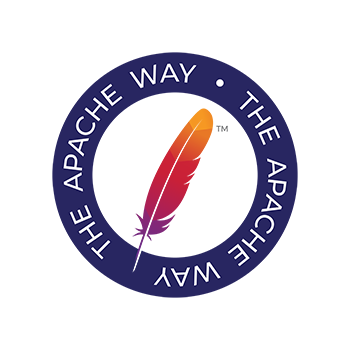

Title: Brand Guidelines | Apache Software Foundation

license: https://www.apache.org/licenses/LICENSE-2.0

# ASF Brand Guidelines
The ASF’s brand guidelines and trademark policy ensure consistent use of our brand logo and assets to help people easily identify the Foundation and its work. All uses of ASF trademarks, service marks, and graphic logos must abide by our [Identity Style Guide](/foundation/press/kit/ApacheFoundation_StyleGuide.pdf) and [Trademark Policy](/foundation/marks/).

**ASF Graphics**
*   [Foundation Logos](#logo) - the formal ASF logo
*   [Powered By Apache Logos](#poweredby) - for Apache projects
*   [Apache Badges](#badges) — pictorial marks of the Apache Feather with taglines

## Foundation Logos {#logo}

### Foundation Logo 

*   [ASF Logo without URL - SVG](asf_logo.svg)

*   [ASF Logo without URL - PDF](asf_logo.pdf)

*   [ASF Logo without URL - EMF](asf_logo.emf)

### Foundation Logo with URL 

*   [ASF Logo with URL - SVG](asf_logo_url.svg)

*   [ASF Logo with URL - PDF](asf_logo_url.pdf)

*   [ASF Logo with URL - EMF](asf_logo_url.emf)

### Wide Foundation Logo  

*   [ASF Logo with URL - SVG](asf_logo_wide.svg)

*   [ASF Logo with URL - PDF](asf_logo_wide.pdf)

*   [ASF Logo with URL - EMF](asf_logo_wide.emf)

### "Established 1999" Foundation Logo

*   [ASF Logo with Estd. 1999 - SVG](asf-estd-1999-logo.svg)

*   [ASF Logo with Estd. 1999 - PNG](asf-estd-1999-logo.png)

### Feathers  

*   [Feather SVG](feather.svg)

*   [Feather PDF](feather.pdf)

*   [Feather EMF](feather.emf)

## Powered By Apache Logos  {#poweredby}

The “Powered By Apache” logo was created in 2014 to celebrate the Apache Software Foundation's 15th Anniversary and promote the ASF's then-more than 200 projects. The logo was updated in January 2016 to reflect the new ASF brand identity.

This logo was specially created to maintain the unique identity of each ASF project whilst identifying all projects under the Apache umbrella. The Apache community at-large are encouraged to display “Powered By Apache” assets on their websites, documentation, and other marketing materials.

Guidelines for the appropriate use of the “Powered By Apache” logos include:

*   The “Powered By Apache” circular banded logo may be used standalone with just the feather logo (denoting general use of an ASF project) or in combination with an official/authorized ASF Project logo.
*   The official/authorized Project logo may not be altered in any way other than removing/separating the name(s) where applicable as approved by the associated Project Management Committee.
*   The appropriate trademark symbol(s), such as ® or ™, associated with the project's logo must be included in the logo.
*   The logo's circular band format, font, and color must not be altered in any way.
*   The logo and/or its contents must not be rotated, animated, distorted, or otherwise altered, nor should it be used as a graphic element, background, or pattern.
*   The logo and/or its contents must not be translated or localized, nor should it have versioning numbers or other unauthorized words added to it.
*   The preferred background color for the logo is white, however, the logo may appear on colored, black, or image/photographic backgrounds providing the logo's legibility is not compromised.
*   The logo may be sized and produced in multiple file formats as required by the Project Management Committee, with a preferred minimum size of 80 pixels high in Web/online applications (where possible) to ensure legibility.
*   The logo may not, under any circumstances, be incorporated with a third party's company name, product name, or logo(s), or adopt marks and/or logos that are confusingly similar to or imply improper association with The Apache Software Foundation.
*   Third parties and programs are not allowed to use official Apache project logos and/or create alternate logos or identifying marks relating to any Apache project without written permission from the associated Project Management Committee and/or ASF Brand Management.
*   We have a [trademark use policy for the "Powered By" phrase][1]

In addition, official Apache Project pages and documentation on apache.org must utilize the appropriate trademark symbols on the respective Project logo, along with the following footnote: "Apache, Apache [PROJECT NAME], and the Apache [PROJECT NAME] logo are registered trademarks or trademarks of The Apache Software Foundation in the U.S. and/or other countries."

### "Powered By" Logo  

[Powered By Apache Logo - PDF](poweredBy/Apache_PoweredBy.pdf)

[Powered By Apache Logo - SVG](poweredBy/Apache_PoweredBy.svg)

[Powered By Apache Logo - EMF](poweredBy/Apache_PoweredBy.emf)

### Project "Powered By" Logos 

![Per-Project Powered By Logo Example][2]

Logos for individual projects, such as the ones below, are available in jpg, png, and psd format. They can be retrieved by requesting http://www.apache.org/foundation/press/kit/poweredBy/pb-PROJECTNAME.jpg, or http://www.apache.org/foundation/press/kit/poweredBy/pb-PROJECTNAME.png, http://www.apache.org/foundation/press/kit/poweredBy/pb-PROJECTNAME.psd.

For example, the Powered by Logo for Apache Tomcat can be retrieved from [poweredBy/pb-tomcat.jpg](poweredBy/pb-tomcat.jpg), [poweredBy/pb-tomcat.png](poweredBy/pb-tomcat.png) and the [poweredBy/pb-tomcat.psd](poweredBy/pb-tomcat.psd)

If you are unable to find the logo you are looking for, try inspecting the [directory listing](poweredBy). If you still can't find what you need please contact the project's mailing list.

### Template for "Powered By" Logos 

 
<a class="btn btn-primary" role="button" data-toggle="collapse" href="#buildPoweredByBadge" aria-expanded="false" aria-controls="buildPoweredByBadge">Build Your Badge</a>

    

        
        

            
With this handy tool you can create your own Project Powered By Badge.

            <ol>
                <li>Select your logo saved in a square format. (Non square images may result in improperly cropped results.)</li>
                <li>Your logo will be displayed in the Powered By badge.</li>
                <li>Now you can save it and use as needed.</li>
            </ol>
            <!-- Change the js-files path here -->
            
            <noscript>Sorry, your browser settings do not support JavaScript!</noscript>
            <form action="#" id="poweredBy_form" onsubmit="return false;">
                <input id="poweredByImgFile" type="file" />
                 
                <input
                id="btnLoad"
                onclick="loadPoweredByImage();"
                type="button"
                value="Generate"
                />&nbsp;
            </form>
             
            

                <canvas id="canvas_poweredBy_1"></canvas>
                
            

            
&nbsp;

        

    

The new blank template for the “Powered By” logos as well as select project “Powered By” logos can be downloaded [here](./poweredBy/powered-by-template-2019). The old template (black “powered by” band) is deprecated and should not be used for any current graphics use.

## ASF Badges  {#badges}

Badges containing pictorial marks of the Apache Feather with various taglines and colors are available for broad community use. These images can be used in any application.

### 

|      |     *Violet*     |     *Orange*     |     *Magenta*    |    *Indigo*   |     *Gray*    |    *Goldenrod*   |   *Crimson*   |
|------|----------------|----------------|----------------|-------------|-------------|-------------|-------------|
| *CMYK* | [AI](img/the-apache-way-badge/Violet-THE_APACHE_WAY_BADGE-cmyk.ai) [EPS](img/the-apache-way-badge/Violet-THE_APACHE_WAY_BADGE-cmyk.eps) [PDF](img/the-apache-way-badge/Violet-THE_APACHE_WAY_BADGE-cmyk.pdf) [SVG](img/the-apache-way-badge/Violet-THE_APACHE_WAY_BADGE-cmyk.svg) | [AI](img/the-apache-way-badge/Orange-THE_APACHE_WAY_BADGE-cmyk.ai) [EPS](img/the-apache-way-badge/Orange-THE_APACHE_WAY_BADGE-cmyk.eps) [PDF](img/the-apache-way-badge/Orange-THE_APACHE_WAY_BADGE-cmyk.pdf) [SVG](img/the-apache-way-badge/Orange-THE_APACHE_WAY_BADGE-cmyk.svg) | [AI](img/the-apache-way-badge/Magenta-THE_APACHE_WAY_BADGE-cmyk.ai) [EPS](img/the-apache-way-badge/Magenta-THE_APACHE_WAY_BADGE-cmyk.eps) [PDF](img/the-apache-way-badge/Magenta-THE_APACHE_WAY_BADGE-cmyk.pdf) [SVG](img/the-apache-way-badge/Magenta-THE_APACHE_WAY_BADGE-cmyk.svg) | [AI](img/the-apache-way-badge/Indigo-THE_APACHE_WAY_BADGE-cmyk.ai) [EPS](img/the-apache-way-badge/Indigo-THE_APACHE_WAY_BADGE-cmyk.eps) [PDF](img/the-apache-way-badge/Indigo-THE_APACHE_WAY_BADGE-cmyk.pdf) [SVG](img/the-apache-way-badge/Indigo-THE_APACHE_WAY_BADGE-cmyk.svg) | [AI](img/the-apache-way-badge/Gray-THE_APACHE_WAY_BADGE-cmyk.ai) [EPS](img/the-apache-way-badge/Gray-THE_APACHE_WAY_BADGE-cmyk.eps) [PDF](img/the-apache-way-badge/Gray-THE_APACHE_WAY_BADGE-cmyk.pdf) [SVG](img/the-apache-way-badge/Gray-THE_APACHE_WAY_BADGE-cmyk.svg) | [AI](img/the-apache-way-badge/Goldenrod-THE_APACHE_WAY_BADGE-cmyk.ai) [EPS](img/the-apache-way-badge/Goldenrod-THE_APACHE_WAY_BADGE-cmyk.eps) [PDF](img/the-apache-way-badge/Goldenrod-THE_APACHE_WAY_BADGE-cmyk.pdf) [SVG](img/the-apache-way-badge/Goldenrod-THE_APACHE_WAY_BADGE-cmyk.svg) | [AI](img/the-apache-way-badge/Crimson-THE_APACHE_WAY_BADGE-cmyk.ai) [EPS](img/the-apache-way-badge/Crimson-THE_APACHE_WAY_BADGE-cmyk.eps) [PDF](img/the-apache-way-badge/Crimson-THE_APACHE_WAY_BADGE-cmyk.pdf) [SVG](img/the-apache-way-badge/Crimson-THE_APACHE_WAY_BADGE-cmyk.svg) |
|  *RGB* | [AI](img/the-apache-way-badge/Violet-THE_APACHE_WAY_BADGE-rgb.ai) [EPS](img/the-apache-way-badge/Violet-THE_APACHE_WAY_BADGE-rgb.eps) [PDF](img/the-apache-way-badge/Violet-THE_APACHE_WAY_BADGE-rgb.pdf) [SVG](img/the-apache-way-badge/Violet-THE_APACHE_WAY_BADGE-rgb.svg) | [AI](img/the-apache-way-badge/Orange-THE_APACHE_WAY_BADGE-rgb.ai) [EPS](img/the-apache-way-badge/Orange-THE_APACHE_WAY_BADGE-rgb.eps) [PDF](img/the-apache-way-badge/Orange-THE_APACHE_WAY_BADGE-rgb.pdf) [SVG](img/the-apache-way-badge/Orange-THE_APACHE_WAY_BADGE-rgb.svg) | [AI](img/the-apache-way-badge/Magenta-THE_APACHE_WAY_BADGE-rgb.ai) [EPS](img/the-apache-way-badge/Magenta-THE_APACHE_WAY_BADGE-rgb.eps) [PDF](img/the-apache-way-badge/Magenta-THE_APACHE_WAY_BADGE-rgb.pdf) [SVG](img/the-apache-way-badge/Magenta-THE_APACHE_WAY_BADGE-rgb.svg) | [AI](img/the-apache-way-badge/Indigo-THE_APACHE_WAY_BADGE-rgb.ai) [EPS](img/the-apache-way-badge/Indigo-THE_APACHE_WAY_BADGE-rgb.eps) [PDF](img/the-apache-way-badge/Indigo-THE_APACHE_WAY_BADGE-rgb.pdf) [SVG](img/the-apache-way-badge/Indigo-THE_APACHE_WAY_BADGE-rgb.svg) | [AI](img/the-apache-way-badge/Gray-THE_APACHE_WAY_BADGE-rgb.ai) [EPS](img/the-apache-way-badge/Gray-THE_APACHE_WAY_BADGE-rgb.eps) [PDF](img/the-apache-way-badge/Gray-THE_APACHE_WAY_BADGE-rgb.pdf) [SVG](img/the-apache-way-badge/Gray-THE_APACHE_WAY_BADGE-rgb.svg) |   [EPS](img/the-apache-way-badge/Goldenrod-THE_APACHE_WAY_BADGE-rgb.eps) [PDF](img/the-apache-way-badge/Goldenrod-THE_APACHE_WAY_BADGE-rgb.pdf) [SVG](img/the-apache-way-badge/Goldenrod-THE_APACHE_WAY_BADGE-rgb.svg) | [AI](img/the-apache-way-badge/Crimson-THE_APACHE_WAY_BADGE-rgb.ai) [EPS](img/the-apache-way-badge/Crimson-THE_APACHE_WAY_BADGE-rgb.eps) [PDF](img/the-apache-way-badge/Crimson-THE_APACHE_WAY_BADGE-rgb.pdf) [SVG](img/the-apache-way-badge/Crimson-THE_APACHE_WAY_BADGE-rgb.svg) |

[1]: /foundation/marks/faq/#poweredby
[2]: /foundation/press/kit/poweredBy/old-template-before-march-2019/Template.PNG "Per-Project Powered By Logo Example"
