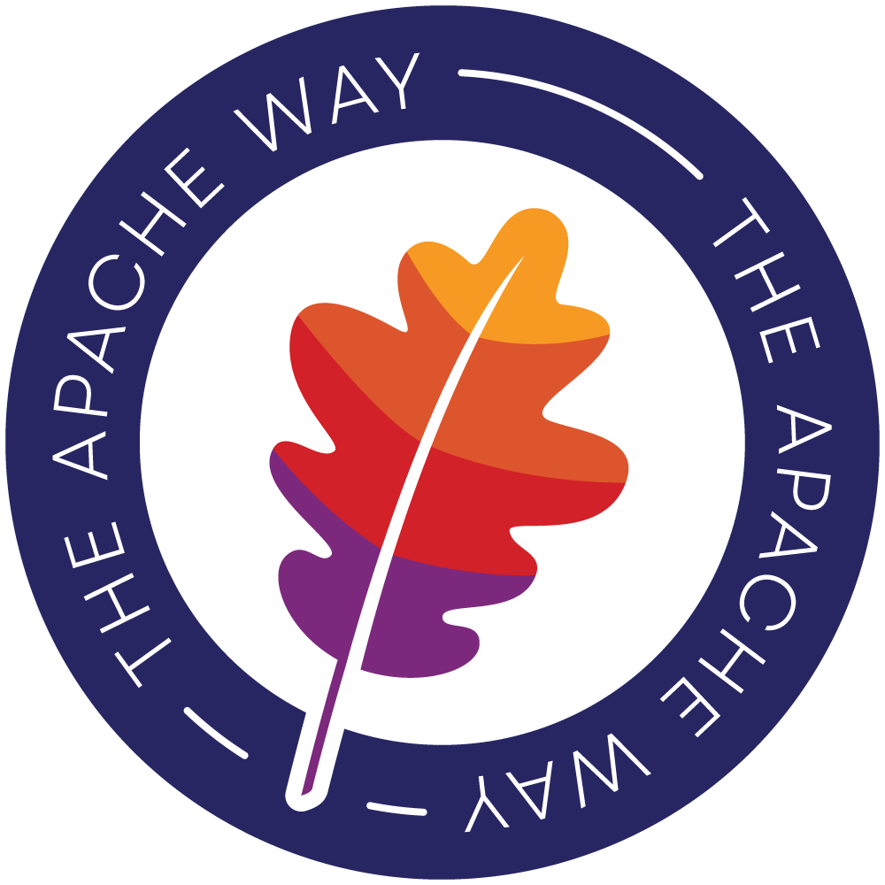

Title: Apache Software Foundation Graphics
license: https://www.apache.org/licenses/LICENSE-2.0

This page contains various graphical assets that can be used by third parties when referring to The Apache Software Foundation or one of its projects.
If you can't find a logo here, or have other questions please see our [Marketing & Publicity team](/press/).

**The Apache Software Foundation owns all Apache-related trademarks, service marks, and graphic logos.** You can read our [formal Trademark Policy](/foundation/marks/) which discusses allowable uses and how to contact us for permissions.

The ASF provides the following resources here:

*   [Powered By Apache Logos](#poweredby) - of our various Apache projects
*   [Feather Graphics](#links) - the formal ASF logo
*   [Official Anniversary Graphics](#20thgraphics) — used for the ASF’s 20th Anniversary
*   [Apache Badges](#badges) — pictorial marks of the Apache Feather with taglines
*   [The ASF Identity Style Guide](/foundation/press/kit/ApacheFoundation_StyleGuide.pdf) - keep the Apache brand unified

[The ASF Identity Style Guide](/foundation/press/kit/ApacheFoundation_StyleGuide.pdf) helps ensure that our visual identity is consistent. We ask that all Apache project communities review and follow our specifications on how the ASF logo can be used. Should you require additional guidance, please contact ASF Marketing & Publicity at press(at)apache(dot)org.

Apache projects provide their official project logos on their respective homepages and are responsible for their maintenance. Most Apache project logos are available for download at [www.apache.org/logos](/logos/) .Please contact each project directly on their dev@ mailing list for for specific assistance or requests.

# Powered By Apache Logos  {#poweredby}

The “Powered By Apache” logo was originally created in 2014 to celebrate The Apache Software Foundation's 15th Anniversary and promote the ASF's then-more than 200 projects. The logo was updated in January 2016 to reflect the new ASF brand identity.

This logo was specially created to maintain the unique identity of each Apache project whilst identifying all projects under the Apache umbrella. The Apache community at-large are encouraged to proudly display “Powered By Apache” assets on their Websites, documentation, marketing materials, etc.

Guidelines for the appropriate use of the “Powered By Apache” logos include:

*   The “Powered By Apache” circular banded logo may be used standalone with just the Apache feather (denoting general use of an Apache project) or in combination with an official/authorized ASF Project logo;
*   The official/authorized Project logo may not be altered in any way other than removing/separating the name(s) where applicable as approved by the associated Project Management Committee;
*   The appropriate trademark symbol(s), such as ® or ™, associated with the project's logo must be included in the logo;
*   The logo's circular band format, font, and color must not be altered in any way;
*   The logo and/or its contents must not be rotated, animated, distorted, or otherwise altered, nor should it be used as a graphic element, background, or pattern;
*   The logo and/or its contents must not be translated or localized, nor should it have versioning numbers or other unauthorized words added to it;
*   The preferred background color for the logo is white, however, the logo may appear on colored, black, or image/photographic backgrounds providing the logo's legibility is not compromised;
*   The logo may be sized and produced in multiple file formats as required by the Project Management Committee, with a preferred minimum size of 80 pixels high in Web/online applications (where possible) to ensure legibility;
*   The logo may not, under any circumstances, be incorporated with a third party's company name, product name, or logo(s), or adopt marks and/or logos that are confusingly similar to or imply improper association with The Apache Software Foundation;
*   Third parties and programs are not allowed to use official Apache project logos and/or create alternate logos or identifying marks relating to any Apache project without written permission from the associated Project Management Committee and/or ASF Brand Management.
*   We have a [trademark use policy for the "Powered By" phrase][1]

In addition, official Apache Project pages and documentation on apache.org must utilize the appropriate trademark symbols on the respective Project logo, along with the following footnote: "Apache, Apache [PROJECT NAME], and the Apache [PROJECT NAME] logo are registered trademarks or trademarks of The Apache Software Foundation in the U.S. and/or other countries."

## Template and Usage  {#template-and-usage}

### Plain Feather "Powered By Apache" Logo  {#plain-feather-powered-by-apache-logo}

[Powered By Apache Logo - PDF](poweredBy/Apache_PoweredBy.pdf)

[Powered By Apache Logo - SVG](poweredBy/Apache_PoweredBy.svg)

[Powered By Apache Logo - EMF](poweredBy/Apache_PoweredBy.emf)

### Per-Project Powered By Logos  {#per-project-powered-by-logos}

![Per-Project Powered By Logo Example][2]

Logos for individual projects, such as the ones below, are available in jpg, png, and psd format. They can be retrieved by requesting http://www.apache.org/foundation/press/kit/poweredBy/pb-PROJECTNAME.jpg, or http://www.apache.org/foundation/press/kit/poweredBy/pb-PROJECTNAME.png, http://www.apache.org/foundation/press/kit/poweredBy/pb-PROJECTNAME.psd.

For example, the Powered by Logo for Apache Tomcat can be retrieved from [poweredBy/pb-tomcat.jpg](poweredBy/pb-tomcat.jpg), [poweredBy/pb-tomcat.png](poweredBy/pb-tomcat.png) and the [poweredBy/pb-tomcat.psd](poweredBy/pb-tomcat.psd)

If you are unable to find the logo you are looking for try inspecting the [directory listing](poweredBy). If you still can't find what you need please contact the projects mailing list.

### Template for the creation of Powered by logos  {#template-for-the-creation-of-powered-by-logos}

 
<a class="btn btn-primary" role="button" data-toggle="collapse" href="#buildPoweredByBadge" aria-expanded="false" aria-controls="buildPoweredByBadge">Build Your Badge</a>

    

        
        

            
With this handy tool you can create your own Project Powered By Badge.

            <ol>
                <li>Select your logo saved in a square format. (Non square images may result in improperly cropped results.)</li>
                <li>Your logo will be displayed in the Powered By badge.</li>
                <li>Now you can save it and use as needed.</li>
            </ol>
            <!-- Change the js-files path here -->
            
            <form action="#" id="poweredBy_form" onsubmit="return false;">
                <input id="poweredByImgFile" type="file" />
                 
                <input
                id="btnLoad"
                onclick="loadPoweredByImage();"
                type="button"
                value="Generate"
                />&nbsp;
            </form>
             
            

                <canvas id="canvas_poweredBy_1"></canvas>
                
            

            
&nbsp;

        

    

The new blank template for the “Powered By” logos as well as select project “Powered By” logos can be downloaded [here](./poweredBy/powered-by-template-2019). The old template (black “powered by” band) is deprecated and should not be used for any current graphics use.

# 20th Anniversary Graphics  {#20thgraphics}

High resolution graphical assets for the 20th Anniversary of The Apache Software Foundation are available for use in approved applications only. 20th Anniversary graphics must point to [http://apache.org/](/) . To get them, please contact press(at)apache(dot)org detailing the specifics for your request.

## Official ASF 20th Anniversary Logo

* [20th Anniversary Logo - PNG](img/20th-anniversary-logo/APACHE-20th-logo.png)
* [20th Anniversary Logo - EPS](img/20th-anniversary-logo/APACHE-20th-logo.eps)

## Official ASF 20th Anniversary Badge

* [20th Anniversary Badge - AI](img/20th-anniversary-badge/APACHE-20th-badge-1-cmyk.ai)
* [20th Anniversary Badge - EPS](img/20th-anniversary-badge/APACHE-20th-badge-1-cmyk.eps)
* [20th Anniversary Badge - PDF](img/20th-anniversary-badge/APACHE-20th-badge-1-cmyk.pdf)
* [20th Anniversary Badge - SVG](img/20th-anniversary-badge/APACHE-20th-badge-1-cmyk.svg)

# Apache Badges  {#badges}

Badges containing pictorial marks of the Apache Feather with various taglines and colors are available for broad community use. These images can be used in any application and can be linked to/from Apache Project sites, ASF Sponsors, ApacheCon Sponsors, and more.

* [20th Anniversary Badge - AI](img/20th-anniversary-badge/APACHE-20th-badge-2-cmyk.ai)
* [20th Anniversary Badge - EPS](img/20th-anniversary-badge/APACHE-20th-badge-2-cmyk.eps)
* [20th Anniversary Badge - PDF](img/20th-anniversary-badge/APACHE-20th-badge-2-cmyk.pdf)
* [20th Anniversary Badge - SVG](img/20th-anniversary-badge/APACHE-20th-badge-2-cmyk.svg)

|      |     *Violet*     |     *Orange*     |     *Magenta*    |    *Indigo*   |     *Gray*    |    *Goldenrod*   |   *Crimson*   |
|------|----------------|----------------|----------------|-------------|-------------|-------------|-------------|
| *CMYK* | [AI](img/the-apache-way-badge/Violet-THE_APACHE_WAY_BADGE-cmyk.ai) [EPS](img/the-apache-way-badge/Violet-THE_APACHE_WAY_BADGE-cmyk.eps) [PDF](img/the-apache-way-badge/Violet-THE_APACHE_WAY_BADGE-cmyk.pdf) [SVG](img/the-apache-way-badge/Violet-THE_APACHE_WAY_BADGE-cmyk.svg) | [AI](img/the-apache-way-badge/Orange-THE_APACHE_WAY_BADGE-cmyk.ai) [EPS](img/the-apache-way-badge/Orange-THE_APACHE_WAY_BADGE-cmyk.eps) [PDF](img/the-apache-way-badge/Orange-THE_APACHE_WAY_BADGE-cmyk.pdf) [SVG](img/the-apache-way-badge/Orange-THE_APACHE_WAY_BADGE-cmyk.svg) | [AI](img/the-apache-way-badge/Magenta-THE_APACHE_WAY_BADGE-cmyk.ai) [EPS](img/the-apache-way-badge/Magenta-THE_APACHE_WAY_BADGE-cmyk.eps) [PDF](img/the-apache-way-badge/Magenta-THE_APACHE_WAY_BADGE-cmyk.pdf) [SVG](img/the-apache-way-badge/Magenta-THE_APACHE_WAY_BADGE-cmyk.svg) | [AI](img/the-apache-way-badge/Indigo-THE_APACHE_WAY_BADGE-cmyk.ai) [EPS](img/the-apache-way-badge/Indigo-THE_APACHE_WAY_BADGE-cmyk.eps) [PDF](img/the-apache-way-badge/Indigo-THE_APACHE_WAY_BADGE-cmyk.pdf) [SVG](img/the-apache-way-badge/Indigo-THE_APACHE_WAY_BADGE-cmyk.svg) | [AI](img/the-apache-way-badge/Gray-THE_APACHE_WAY_BADGE-cmyk.ai) [EPS](img/the-apache-way-badge/Gray-THE_APACHE_WAY_BADGE-cmyk.eps) [PDF](img/the-apache-way-badge/Gray-THE_APACHE_WAY_BADGE-cmyk.pdf) [SVG](img/the-apache-way-badge/Gray-THE_APACHE_WAY_BADGE-cmyk.svg) | [AI](img/the-apache-way-badge/Goldenrod-THE_APACHE_WAY_BADGE-cmyk.ai) [EPS](img/the-apache-way-badge/Goldenrod-THE_APACHE_WAY_BADGE-cmyk.eps) [PDF](img/the-apache-way-badge/Goldenrod-THE_APACHE_WAY_BADGE-cmyk.pdf) [SVG](img/the-apache-way-badge/Goldenrod-THE_APACHE_WAY_BADGE-cmyk.svg) | [AI](img/the-apache-way-badge/Crimson-THE_APACHE_WAY_BADGE-cmyk.ai) [EPS](img/the-apache-way-badge/Crimson-THE_APACHE_WAY_BADGE-cmyk.eps) [PDF](img/the-apache-way-badge/Crimson-THE_APACHE_WAY_BADGE-cmyk.pdf) [SVG](img/the-apache-way-badge/Crimson-THE_APACHE_WAY_BADGE-cmyk.svg) |
|  *RGB* | [AI](img/the-apache-way-badge/Violet-THE_APACHE_WAY_BADGE-rgb.ai) [EPS](img/the-apache-way-badge/Violet-THE_APACHE_WAY_BADGE-rgb.eps) [PDF](img/the-apache-way-badge/Violet-THE_APACHE_WAY_BADGE-rgb.pdf) [SVG](img/the-apache-way-badge/Violet-THE_APACHE_WAY_BADGE-rgb.svg) | [AI](img/the-apache-way-badge/Orange-THE_APACHE_WAY_BADGE-rgb.ai) [EPS](img/the-apache-way-badge/Orange-THE_APACHE_WAY_BADGE-rgb.eps) [PDF](img/the-apache-way-badge/Orange-THE_APACHE_WAY_BADGE-rgb.pdf) [SVG](img/the-apache-way-badge/Orange-THE_APACHE_WAY_BADGE-rgb.svg) | [AI](img/the-apache-way-badge/Magenta-THE_APACHE_WAY_BADGE-rgb.ai) [EPS](img/the-apache-way-badge/Magenta-THE_APACHE_WAY_BADGE-rgb.eps) [PDF](img/the-apache-way-badge/Magenta-THE_APACHE_WAY_BADGE-rgb.pdf) [SVG](img/the-apache-way-badge/Magenta-THE_APACHE_WAY_BADGE-rgb.svg) | [AI](img/the-apache-way-badge/Indigo-THE_APACHE_WAY_BADGE-rgb.ai) [EPS](img/the-apache-way-badge/Indigo-THE_APACHE_WAY_BADGE-rgb.eps) [PDF](img/the-apache-way-badge/Indigo-THE_APACHE_WAY_BADGE-rgb.pdf) [SVG](img/the-apache-way-badge/Indigo-THE_APACHE_WAY_BADGE-rgb.svg) | [AI](img/the-apache-way-badge/Gray-THE_APACHE_WAY_BADGE-rgb.ai) [EPS](img/the-apache-way-badge/Gray-THE_APACHE_WAY_BADGE-rgb.eps) [PDF](img/the-apache-way-badge/Gray-THE_APACHE_WAY_BADGE-rgb.pdf) [SVG](img/the-apache-way-badge/Gray-THE_APACHE_WAY_BADGE-rgb.svg) |   [EPS](img/the-apache-way-badge/Goldenrod-THE_APACHE_WAY_BADGE-rgb.eps) [PDF](img/the-apache-way-badge/Goldenrod-THE_APACHE_WAY_BADGE-rgb.pdf) [SVG](img/the-apache-way-badge/Goldenrod-THE_APACHE_WAY_BADGE-rgb.svg) | [AI](img/the-apache-way-badge/Crimson-THE_APACHE_WAY_BADGE-rgb.ai) [EPS](img/the-apache-way-badge/Crimson-THE_APACHE_WAY_BADGE-rgb.eps) [PDF](img/the-apache-way-badge/Crimson-THE_APACHE_WAY_BADGE-rgb.pdf) [SVG](img/the-apache-way-badge/Crimson-THE_APACHE_WAY_BADGE-rgb.svg) |

# #LoveApache  {#loveapache}

\#LoveApache: here is your chance to put your image at the heart of it all to be used online, in stickers, etc. The template is available below.

 
<a class="btn btn-primary" role="button" data-toggle="collapse" href="#buildLoveApacheBadge" aria-expanded="false" aria-controls="buildLoveApacheBadge">Build Your Badge</a>

    

        
        

            
With this handy tool you can create your own #LoveApache Badge.

            <ol>
                <li>Select your picture.</li>
                <li>Your picture will be displayed in the #LoveApache badge.</li>
                <li>Now you can save and upload it as your profile picture on Twitter or other platforms.</li>
            </ol>
            <!-- Change the js-files path here -->
            
            <form action="#" id="twibbon_form" onsubmit="return false;">
                <input id="imgfile" type="file" />
                 
                <input
                id="btnLoad"
                onclick="loadImage();"
                type="button"
                value="Generate"
                />&nbsp;
            </form>
             
            

                <canvas id="canvas_twibbon_1"></canvas>
                
            

            
&nbsp;

        

    

* [#LOVEAPACHE Badge - AI](img/loveapache-badge/loveapache-badge-template-cmyk.ai)
* [#LOVEAPACHE Badge - EPS](img/loveapache-badge/loveapache-badge-template-cmyk.eps)
* [#LOVEAPACHE Badge - PDF](img/loveapache-badge/loveapache-badge-template-cmyk.pdf)
* [#LOVEAPACHE Badge - SVG](img/loveapache-badge/loveapache-badge-template-cmyk.svg)

# ApacheCon 2020 @Home Badge

* [ApacheCon 2020 @Home Badge - AI](img/apachecon-badge/apachecon2020.ai)
* [ApacheCon 2020 @Home Badge - EPS](img/apachecon-badge/apachecon2020.eps)
* [ApacheCon 2020 @Home Badge - PDF](img/apachecon-badge/apachecon2020.pdf)
* [ApacheCon 2020 @Home Badge - SVG](img/apachecon-badge/apachecon2020.svg)

# Feather Graphics Downloads  {#policy}

This section contains downloadable graphics of The Apache Software Foundation (ASF) feather trademark.

**REMINDER:** The feather graphics are trademarks of the ASF, and must not be used without appropriate attribution and permission from the ASF. Please see our [formal Trademark Policy](/foundation/marks/) for more details.
In particular, as a vendor-neutral public charity that provides indepenent governance to all Apache projects, you must use care when displaying the feather, and ensure it's clear that it's referring to the ASF as an independent organization.

# Feathers  {#links}

This is the latest version of the feather, click for high resolution PNG

*   [Feather SVG](feather.svg)

*   [Feather PDF](feather.pdf)

*   [Feather EMF](feather.emf)

# Foundation Logo with Feather  {#logo}

The latest version of the Foundation Logo, including the Feather is

*   [ASF Logo without URL - SVG](asf_logo.svg)

*   [ASF Logo without URL - PDF](asf_logo.pdf)

*   [ASF Logo without URL - EMF](asf_logo.emf)

# Foundation Logo with Feather and URL  {#logo-url}

The latest version of the Foundation Logo, including the Feather and URL is

*   [ASF Logo with URL - SVG](asf_logo_url.svg)

*   [ASF Logo with URL - PDF](asf_logo_url.pdf)

*   [ASF Logo with URL - EMF](asf_logo_url.emf)

# Wide Foundation Logo with Feather  {#wide}

The latest version of the Foundation Logo, including the Feather and URL is

*   [ASF Logo with URL - SVG](asf_logo_wide.svg)

*   [ASF Logo with URL - PDF](asf_logo_wide.pdf)

*   [ASF Logo with URL - EMF](asf_logo_wide.emf)

# "Established 1999" Foundation Logo with Feather

The latest version of the Foundation Logo, including the Feather and "Established 1999" notation is

*   [ASF Logo with Estd. 1999 - SVG](asf-estd-1999-logo.svg)

*   [ASF Logo with Estd. 1999 - PNG](asf-estd-1999-logo.png)

# Previous Versions  {#previous-versions}

The Apache Feather and Apache Software Foundation logo have both undergone changes over time. Older versions are available below, but shouldn't normally be used.

### Left-to-Right Feather (Original, horizontal orientation)  {#left-to-right-feather-original}

*   [feather.svg](feather_logo_RGB.svg) Bare feather -  SVG format

*   [feather.ill](feather.ill) Bare feather -  Adobe Illustrator (PS) format

*   [apache_pb.ill](apache_pb.ill) Powered By Apache -  Adobe Illustrator (PS) format

*   [feather.gif](/images/feather.gif) -  Bare feather, no TM symbol - GIF Format

*   [feather.png](/images/feather.png) -  Bare feather, no TM symbol - PNG Format

*   [feathertm.gif](/images/feathertm.gif) -  Bare feather with TM symbol - GIF Format

*   Bare feather, no TM symbol, Vector (Scalable) Formats, CMYK colour space

  *   [feather_logo_CMYK.svg](feather_logo_CMYK.svg) -  SVG Format
  *   [feather_logo_CMYK.eps](feather_logo_CMYK.eps) -  EPS Format
  *   [feather_logo_CMYK.ai](feather_logo_CMYK.ai) -  Illustrator (PDF) Format
*   Bare feather, no TM symbol, Vector (Scalable) Formats, RGB colour space

  *   [feather_logo_RGB.svg](feather_logo_RGB.svg) -  SVG Format
  *   [feather_logo_RGB.eps](feather_logo_RGB.eps) -  EPS Format
  *   [feather_logo_RGB.ai](feather_logo_RGB.ai) -  Illustrator (PDF) Format
*   [asf_logo.gif](/images/asf_logo.gif) -  Feather with Foundation Name and URL - GIF Format

*   [asf_logo_wide.png](/images/asf_logo_wide.png) - Feather with Foundation Name and URL, wide - PNG Format

*   [asf_logo.eps](/foundation/press/kit/asf_logo.eps) Feather with Foundation Name and URL - EPS Format

[1]: /foundation/marks/faq/#poweredby
[2]: /foundation/press/kit/poweredBy/old-template-before-march-2019/Template.PNG "Per-Project Powered By Logo Example"
