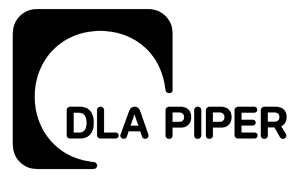
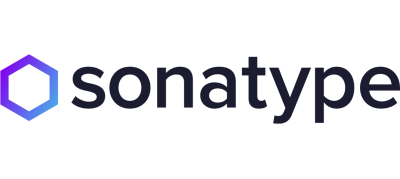

Title: Our Sponsors | Apache Software Foundation

license: https://www.apache.org/licenses/LICENSE-2.0

# Our Sponsors

The Apache Software Foundation could not exist without the continued
generous support from the community. We would like to take this opportunity
to thank our sponsors. If you are interested in sponsoring the ASF, please
read our [sponsorship page](/foundation/sponsorship.html).

## Foundation Sponsors

   <link rel="stylesheet" href="/css/thanks.css">
   <h3 class="h1"style="text-align: center;">Platinum Sponsors:</h3> <!-- 400x179 --> <!-- Platinum images should be exact size for CSS -->
   

   <ul id='platinum'>
       <li>
Apple
</li>
      <li>
Amazon Web Services
</li>
      <li>
Facebook
</li>
      <li>
Google
</li>
      <li>
Huawei
</li>
      <li>
Microsoft
</li>
      <li>
Pineapple Fund
</li>
      <li>
VMware
</li>
      <li>
Yahoo!
</li>
   </ul>
   

   <h3 class="h1"style="text-align: center;">Gold Sponsors:</h3>  <!-- 223x100 --> <!-- Gold images should be exact size for CSS -->
   

   <ul id='gold'>
      <li>
Aiven
</li>
      <li>
Anonymous
</li>
      <li>
Baidu
</li>
      <li>
Bloomberg
</li>
      <li>
Cloudera
</li>
      <li>
Confluent
</li>
      <li>
IBM
</li>
      <li>
Indeed
</li>
      <li>
OceanX
</li>
      <li>
Salesforce
</li>
      <li>
Union Investment
</li>
      <li>
VISA
</li>
      <li>
Workday
</li>
   </ul>
   

   <h3 class="h1"style="text-align: center;">Silver Sponsors:</h3>  <!-- 150x67 -->
   

   <ul id='silver'>
      <li>
Aetna
</li>
      <li>
Alibaba Cloud Computing
</li>
      <li>
Capital One
</li>
      <li>
Didi Chuxing
</li>
      <li>
LINE
</li>
      <li>
Red Hat, Inc.
</li>
      <li>
Talend
</li>
      <li>
Target
</li>
   </ul>
   

   <h3 class="h1"style="text-align: center;">Bronze Sponsors:</h3> <!-- text only -->
   

   <ul id='bronze'>
      <li><a target="_blank" rel="sponsored" href="https://www.bestecasinobonussen.nl/">Bestecasinobonussen.nl</a></li>
      <li><a target="_blank" rel="sponsored" href="https://www.cafe24.com/en/?utm_source=apache&utm_medium=offlink&utm_campaign=mktbuilding-march-2021">Cafe24</a></li>
      <li><a target="_blank" rel="sponsored" href="http://engineering.cerner.com/">Cerner</a></li>
      <li><a target="_blank" rel="sponsored" href="https://craftercms.org">Crafter CMS</a></li>
      <li><a target="_blank" rel="sponsored" href="https://curity.io/">Curity</a></li>
      <li><a target="_blank" rel="sponsored" href="https://dimealley.com/installment-loans/">Dime Alley</a></li>
      <li><a target="_blank" rel="sponsored" href="https://dollarhand.com/">Dollar Hand</a></li>
      <li><a target="_blank" rel="sponsored" href="https://goread.io/buy-instagram-followers">Goread.io Followers</a></li>
      <li><a target="_blank" rel="sponsored" href="https://www.gridgain.com">GridGain</a></li>
      <li><a target="_blank" rel="sponsored" href="https://www.hotwaxsystems.com">HotWax Systems</a></li>
      <li><a target="_blank" rel="sponsored" href="https://www.leovegas.com/en-in/">LeoVegas Indian Online Casino</a></li>
      <li><a target="_blank" rel="sponsored" href="https://www.libriciel.fr/">Libriciel</a></li>
      <li><a target="_blank" rel="sponsored" href="https://www.miro-kredit.ch/">Miro-Kredit AG</a></li>
      <li><a target="_blank" rel="sponsored" href="https://www.openlogic.com/">OpenLogic by Perforce</a></li>
      <li><a target="_blank" rel="sponsored" href="https://aboutpaf.com/">Paf</a></li>
      <li><a target="_blank" rel="sponsored" href="https://www.praca.pl/">Praca.pl</a></li>
      <li><a target="_blank" rel="sponsored" href="https://www.purevpn.com/">PureVPN</a></li>
      <li><a target="_blank" rel="sponsored" href="https://rx-m.com/">RX-M</a></li>
      <li><a target="_blank" rel="sponsored" href="https://www.renre.com/">RenaissanceRe</a></li>
      <li><a target="_blank" rel="sponsored" href="https://sentry.io/welcome/">Sentry</a></li>
      <li><a target="_blank" rel="sponsored" href=" https://www.tii.ae/">Technology Innovation Institute</a></li>
      <li><a target="_blank" rel="sponsored" href="https://www.theblogstarter.com/">The Blog Starter</a></li>
      <li><a target="_blank" rel="sponsored" href="http://www.twitter.com/">Twitter</a></li>
      <li><a target="_blank" rel="sponsored" href="https://writersperhour.com">Writers Per Hour</a></li>
   </ul>
   

## Targeted Sponsors

ASF Targeted Sponsors provide the Foundation with contributions for specific activities or programs, such as donating cloud services, funding a project hackathon, providing legal services, offering a community member benefit, underwriting expenses for our flagship event, or something entirely new. It's the Apache way of recognizing the sponsors that we rely on every day outside of and often in addition to funding our general operations.

<!-- Targeted Sponsors -->
   <h3 class="h1"style="text-align: center;">Targeted Platinum Sponsors:</h3> <!-- 400x179 -->   <!-- Platinum images should be exact size for CSS -->
   

   <ul id='targetedplatinum'>
      <li>
Amazon Web Services
</li>
      <li>
CloudBees
</li>
      <li>
DLA Piper
</li>
      <li>
LeaseWeb
</li>
      <li>
JFrog
</li>
      <li>
Microsoft
</li>
      <li>
OSU Open Source Labs
</li>
      <li>
Yahoo!
</li>
      <li>
Sonatype
</li>
      <li>
JetBrains
</li>
      <li>
Fastly
</li>
      <li>
GitHub
</li>
   </ul>
   

   <h3 class="h1"style="text-align: center;">Targeted Gold Sponsors:</h3> <!-- 223x100 -->  <!-- Gold images should be exact size for CSS -->
   

   <ul id='targetedgold'>
      <li>
Atlassian
</li>
      <li>
Datadog
</li>
      <li>
Docker
</li>
      <li>
PhoenixNAP
</li>
      <li>
DinoSource
</li>
   </ul>
   

  
   <h3 class="h1"style="text-align: center;">Targeted Silver Sponsors:</h3> <!-- 150x67 -->
   

   <ul id='targetedsilver'>
      <li>
Instaclustr
</li>
      <li>
Rackspace
</li>
      <li>
Xiaomi
</li>
   </ul>
   
  

   <h3 class="h1"style="text-align: center;">Targeted Bronze Sponsors:</h3> <!-- text only -->
   

   <ul id='targetedbronze'>
      <li><a target="_blank" rel="sponsored" href="https://www.techatbloomberg.com/opensource">Bloomberg</a></li>
      <li><a target="_blank" rel="sponsored" href="https://www.ena.com/">Education Networks of America</a></li>
      <li><a target="_blank" rel="sponsored" href="https://cordova.apache.org/">Friend of Apache Cordova</a></li>
      <li><a target="_blank" rel="sponsored" href="https://www.google.com/">Google</a></li>
      <li><a target="_blank" rel="sponsored" href="https://www.hopsie.com/">Hopsie</a></li>
      <li><a target="_blank" rel="sponsored" href="https://www.noip.com/">No-IP</a></li>
      <li><a target="_blank" rel="sponsored" href="https://www.pagerduty.com/">PagerDuty</a></li>
      <li><a target="_blank" rel="sponsored" href="https://www.pccc.com/">Peregrine Computer Consultants Corporation</a></li>
      <li><a target="_blank" rel="sponsored" href="https://www.sonic.com/">Sonic.net</a></li>
      <li><a target="_blank" rel="sponsored" href="http://www.surfnet.nl/">SURFnet</a></li>
      <li><a target="_blank" rel="sponsored" href="https://www.virtru.com/">Virtru</a></li>
   </ul>
   

<noscript>Sorry, your browser settings do not support JavaScript!</noscript>
 
