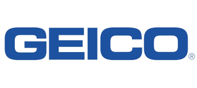

Title: Our Sponsors
license: https://www.apache.org/licenses/LICENSE-2.0

The Apache Software Foundation could not exist without the continued
generous support from the community. We would like to take this opportunity
to thank our sponsors. If you are interested in sponsoring the ASF, please
read our [sponsorship page](/foundation/sponsorship.html).

<h2 class="text-center">Foundation Sponsors</h2>
<h3 class="h1"style="text-align: center;">Platinum Sponsors:</h3> <!-- 400x179 --> <!-- Platinum images should be exact size for CSS -->

    

        <a target="_blank" rel="sponsored" href="https://www.apple.com/">
            
            
Apple

        </a>
    

    

        <a target="_blank" rel="sponsored" href="https://aws.amazon.com/">
            
            
Amazon Web Services

        </a>
    

    

        <a target="_blank" rel="sponsored" href="https://www.meta.com/about/">
            
            
Meta

        </a>
    

    

        <a target="_blank" rel="sponsored" href="https://www.geico.com/tech/">
            
            
GEICO

        </a>
    

    

        <a target="_blank" rel="sponsored" href="http://google.com/">
            
            
Google

        </a>
    

    

        <a target="_blank" rel="sponsored" href="http://huawei.com/">
            
            
Huawei

        </a>
    

    

        <a target="_blank" rel="sponsored" href="https://microsoft.com/">
            
            
Microsoft

        </a>
    

    

        <a target="_blank" rel="sponsored" href="https://news.apache.org/foundation/entry/the-apache-software-foundation-receives">
            
            
Pineapple Fund

        </a>
    

    

        <a target="_blank" rel="sponsored" href="https://www.snowflake.com/">
            
            
Snowflake

        </a>
    

    

        <a target="_blank" rel="sponsored" href="https://www.visa.com/">
            
            
VISA

        </a>
    

    

        <a target="_blank" rel="sponsored" href="https://yahooinc.com/">
            
            
Yahoo!

        </a>
    

<h3 class="h1"style="text-align: center;">Gold Sponsors:</h3>  <!-- 223x100 --> <!-- Gold images should be exact size for CSS -->

    

        <a target="_blank" rel="sponsored" href="https://aiven.io/">
            
            
Aiven

        </a>
    

    

        <a target="_blank" rel="sponsored" href="https://apache.org/">
            
            
Anonymous

        </a>
    

    

        <a target="_blank" rel="sponsored" href="http://www.baidu.com/">
            
            
Baidu

        </a>
    

    

        <a target="_blank" rel="sponsored" href="https://www.TechAtBloomberg.com/opensource">
            
            
Bloomberg

        </a>
    

    

        <a target="_blank" rel="sponsored" href="https://opensource.bytedance.com">
            
            
ByteDance

        </a>
    

    

        <a target="_blank" rel="sponsored" href="http://cloudera.com/">
            
            
Cloudera

        </a>
    

    

        <a target="_blank" rel="sponsored" href="https://www.confluent.io/">
            
            
Confluent

        </a>
    

    

        <a target="_blank" rel="sponsored" href="http://ibm.com/">
            
            
IBM

        </a>
    

    

        <a target="_blank" rel="sponsored" href="http://www.union-investment.de/">
            
            
Union Investment

        </a>
    

    

        <a target="_blank" rel="sponsored" href="https://www.workday.com/">
            
            
Workday

        </a>
    

<h3 class="h1"style="text-align: center;">Silver Sponsors:</h3>  <!-- 150x67 -->

    

        <a target="_blank" rel="sponsored" href="https://www.americanexpress.com/en-us/careers/career-areas/technology/">
            
            
American Express

        </a>
    

    

        <a target="_blank" rel="sponsored" href="https://www.capitalone.com/">
            
            
Capital One

        </a>
    

    

        <a target="_blank" rel="sponsored" href="https://www.dkb.de/">
            
            
DKB

        </a>
    

    

        <a target="_blank" rel="sponsored" href="https://www.indeed.com/">
            
            
Indeed

        </a>
    

    

        <a target="_blank" rel="sponsored" href="https://www.lycorp.co.jp/en/">
            
            
LY Corporation

        </a>
    

    

        <a target="_blank" rel="sponsored" href="http://www.redhat.com/">
            
            
Red Hat, Inc.

        </a>
    

<h3 class="h1"style="text-align: center;">Bronze Sponsors:</h3> <!-- text only -->

    <ul id='bronze' class="sponsors-col-list">
        <li><a target="_blank" rel="sponsored" href="https://www.canva.com/">Canva Engineering</a></li>
        <li><a target="_blank" rel="sponsored" href="https://www.cargurus.com/">CarGurus</a></li>
        <li><a target="_blank" rel="sponsored" href="https://curity.io/">Curity</a></li>
        <li><a target="_blank" rel="sponsored" href="https://www.gridgain.com">GridGain</a></li>
        <li><a target="_blank" rel="sponsored" href="https://www.getgrist.com">Grist Labs</a></li>
        <li><a target="_blank" rel="sponsored" href="https://www.libriciel.fr/">Libriciel</a></li>
        <li><a target="_blank" rel="sponsored" href="https://rx-m.com/">RX-M</a></li>
        <li><a target="_blank" rel="sponsored" href="https://www.renre.com/">RenaissanceRe</a></li>
        <li><a target="_blank" rel="sponsored" href="https://sentry.io/welcome/?utm_source=apacheorg&utm_medium=site&utm_campaign=general-na-evergreen&utm_content=logo-thanksdevsitelogo-na">Sentry</a></li>
    </ul>

## Targeted Sponsors

ASF Targeted Sponsors provide the Foundation with contributions for specific activities or programs, such as donating cloud services, funding a project hackathon, providing legal services, offering a community member benefit, underwriting expenses for our flagship event, or something entirely new. It's the Apache way of recognizing the sponsors that we rely on every day outside of and often in addition to funding our general operations.

<!-- Targeted Sponsors -->
<h3 class="h1"style="text-align: center;">Targeted Platinum Sponsors:</h3> <!-- 400x179 -->   <!-- Platinum images should be exact size for CSS -->

    

        <a target="_blank" rel="sponsored" href="https://aws.amazon.com/">
            
            
Amazon Web Services

        </a>
    

    

        <a target="_blank" rel="sponsored" href="https://www.cloudbees.com/">
            
            
CloudBees

        </a>
    

    

        <a target="_blank" rel="sponsored" href="https://www.dlapiper.com/">
            
            
DLA Piper

        </a>
    

    

        <a target="_blank" rel="sponsored" href="https://gradle.com/">
            
            
Gradle Technologies

        </a>
    

    

        <a target="_blank" rel="sponsored" href="https://jfrog.com/open-source/">
            
            
JFrog

        </a>
    

    

        <a target="_blank" rel="sponsored" href="https://microsoft.com/">
            
            
Microsoft

        </a>
    

    

        <a target="_blank" rel="sponsored" href="https://yahooinc.com/">
            
            
Yahoo!

        </a>
    

    

        <a target="_blank" rel="sponsored" href="http://www.sonatype.com/nexus/product-overview">
            
            
Sonatype

        </a>
    

    

        <a target="_blank" rel="sponsored" href="https://www.jetbrains.com/">
            
            
JetBrains

        </a>
    

    

        <a target="_blank" rel="sponsored" href="https://fastly.com/">
            
            
Fastly

        </a>
    

    

        <a target="_blank" rel="sponsored" href="https://github.com/">
            
            
GitHub

        </a>
    

<h3 class="h1"style="text-align: center;">Targeted Gold Sponsors:</h3> <!-- 223x100 -->  <!-- Gold images should be exact size for CSS -->

    

        <a target="_blank" rel="sponsored" href="https://www.atlassian.com/">
            
            
Atlassian

        </a>
    

    

        <a target="_blank" rel="sponsored" href="https://www.datadoghq.com/">
            
            
Datadog

        </a>
    

    

        <a target="_blank" rel="sponsored" href="https://www.docker.com/">
            
            
Docker

        </a>
    

    

        <a target="_blank" rel="sponsored" href="http://phoenixnap.com/">
            
            
PhoenixNAP

        </a>
    

    

        <a target="_blank" rel="sponsored" href="https://dinosource.co/">
            
            
DinoSource

        </a>
    

<h3 class="h1"style="text-align: center;">Targeted Silver Sponsors:</h3> <!-- 150x67 -->

    

        <a target="_blank" rel="sponsored" href="https://www.instaclustr.com/?utm_source=partner&utm_medium=asf&utm_campaign=homepage">
            
            
NetApp Instaclustr

        </a>
    

    

        <a target="_blank" rel="sponsored" href="https://sourceforge.net/">
            
            
SourceForge

        </a>
    

    

        <a target="_blank" rel="sponsored" href="https://www.mi.com/">
            
            
Xiaomi

        </a>
    

<h3 class="h1"style="text-align: center;">Targeted Bronze Sponsors:</h3> <!-- text only -->

    <ul id='targetedbronze' class="sponsors-col-list">
        <li><a target="_blank" rel="sponsored" href="https://www.techatbloomberg.com/opensource">Bloomberg</a></li>
        <li><a target="_blank" rel="sponsored" href="https://www.ena.com/">Education Networks of America</a></li>
        <li><a target="_blank" rel="sponsored" href="https://www.google.com/">Google</a></li>
        <li><a target="_blank" rel="sponsored" href="https://www.hopsie.com/">Hopsie</a></li>
        <li><a target="_blank" rel="sponsored" href="https://www.noip.com/">No-IP</a></li>
        <li><a target="_blank" rel="sponsored" href="https://www.pagerduty.com/">PagerDuty</a></li>
        <li><a target="_blank" rel="sponsored" href="https://www.pccc.com/">Peregrine Computer Consultants Corporation</a></li>
        <li><a target="_blank" rel="sponsored" href="https://www.sonic.com/">Sonic.net</a></li>
        <li><a target="_blank" rel="sponsored" href="http://www.surfnet.nl/">SURFnet</a></li>
        <li><a target="_blank" rel="sponsored" href="https://www.virtru.com/">Virtru</a></li>
    </ul>

<noscript>Sorry, your browser settings do not support JavaScript!</noscript>
 
