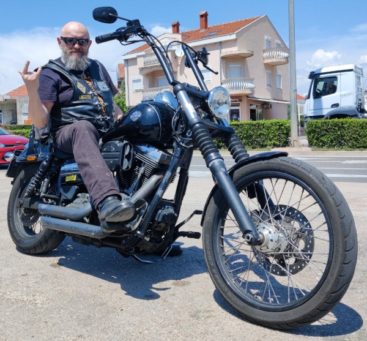

Title:     Mladen Turk - April 17th 2025
license: https://www.apache.org/licenses/LICENSE-2.0

 

#  {{title}}

Mladen Turk passed away suddenly and peacefully on April 17, 2025, aged 62.

He was the Apache Tomcat PMC Chair, as well as a long time contributor
and PMC member of Apache Tomcat, Apache Portable Runtime, and Apache Traffic
Server. His technical expertise on Windows in particular, will be
missed.

Of course, technical contributions are important, but most importantly
many can remember the good times we had at ApacheCon and Community
Over Code conferences, with lots of good beer and fun, in particular
at the Las Vegas conference in 2019 where he got married and we
celebrated together.

First and foremost he was a biker and many at his MC in Croatia
mourned his passing.

RIP Mladen !

